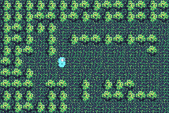
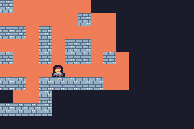
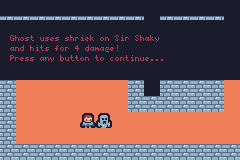

# tinyrogue

Fun package for creating [roguelike games](https://en.wikipedia.org/wiki/Roguelike) using TinyGo on [Firefly Zero](https://fireflyzero.com/).

## Features

### Complete

- Customizable images with cache for tiles such as walls and floors
- Generative maps
- Field of View for torch-like illumination

- Creature behavior is configurable
- Creatures approach Player using shortest path astar algorithm
- Configurable action system for combat, spells, etc.
- Popup dialogs for messages e.g. "A wild gopher has appeared!"
- Creature spawning
- Automatic terrain image variation for walls and floors

### TODO

- Game items
- Predefined maps/levels
- Multiple levels
- World map
- Level entrances/exits
- ?

## Examples

Here is a simple "Hello, Gopher" example that shows a little bit of what you can do:

[Hello, Gopher](./examples/hello/)

A more complete example is the "Ghost Castle" game located here:

https://github.com/deadprogram/ghost-castle

## Useful tools

Here is a short list of some useful tools:

### Convert existing images to Sweetie 16 pallette
https://tezumie.github.io/Image-to-Pixel/

## Credits

Based on code originally from the following sources, but with many modifications:

https://github.com/cscazorla/roguelike

https://github.com/gogue-framework/gogue

Thank you!
