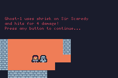

# TinyRogue


Fun package for creating [roguelike games](https://en.wikipedia.org/wiki/Roguelike) using [TinyGo](https://tinygo.org/) on [Firefly Zero](https://fireflyzero.com/).

## Features

### Complete


- Customizable images with cache for tiles such as walls and floors
- Generative maps


- Field of View for torch-like illumination

- Creature behavior is configurable
- Creatures approach Player using shortest path astar algorithm



- Configurable action system for combat, spells, etc.
- Popup dialogs for messages e.g. "A wild gopher has appeared!"
- Creature spawning
- Automatic terrain image variation for walls and floors
- Multiple dungeons each with multiple levels.
- Portals aka level entrances/exits

### TODO

- Game items
- Predefined maps/levels
- World map
- Show/hide entrances/exits
- PortalTypes per dungeon
- ?

## Examples

Here is a simple "Hello, Gopher" example that shows a little bit of what you can do:

```go
package main

import (
	"github.com/deadprogram/tinyrogue"
	"github.com/firefly-zero/firefly-go/firefly"
)

func init() {
	firefly.Boot = boot
	firefly.Update = update
	firefly.Render = render
}

var game *tinyrogue.Game

func boot() {
	// create a new game
	game = tinyrogue.NewGame()

	// load the image tiles for the floor and walls
	game.LoadImage("floor")
	game.LoadImage("wall")

	// set the dimensions for the game and the tiles
	gd := tinyrogue.NewGameData(16, 10, 16, 16)
	game.SetData(gd)

	// generate a random game map
	game.SetMap(tinyrogue.NewSingleLevelGameMap())

	// create the player
	player := tinyrogue.NewPlayer("Player", "player", game.LoadImage("player"), 5)
	game.SetPlayer(player)

	// set player initial position to some open spot on the map.
	player.MoveTo(game.CurrentLevel().OpenLocation())
}

func update() {
	game.Update()
}

func render() {
	game.Render()
}
```
The code for this is located at [Hello, Gopher](./examples/hello/)

### More examples

- For slightly more complex behavior, see the "Gopher Walk" game located here: [Gopher Walk](./examples/walk/)

- An example that has multiple Levels: [Gopher Multiwalk](./examples/multiwalk/)

- Example that has multiple Dungeons/Levels: [Gopher Multidungeon](./examples/multidungeon/)

### Complete Games

A complete game is "Ghost Castle" located in this repo: https://github.com/deadprogram/ghost-castle

"Ghost Castle" is in the Firefly Zero catalog here: https://catalog.fireflyzero.com/deadprogram.ghost-castle

## Architecture diagram

This diagram shows the relationship between the different types that make up a TinyRogue game.


### Game

`Game` is what you are making that the user can play.

### Player

The `Player` represents the person playing the `Game`.

### Creatures

`Creatures` are the non-player characters. Could be monsters, allies, or ?

### GameMap

`GameMap` is what contains the important information about the world in which the game is played.

### Dungeon

A `Dungeon` is a collection of `Levels` that the `Player` will explore.

### Level

A `Level` in an individual level which contains a collection of `MapTiles` and a collection of `Rooms`.

### MapTile

`MapTile` is an individual tile on a grid which represents the positions of the walls, floor, player, and the creatures.

### Room

A `Room` is a rectangular area of a `Level` which is open to the `Player` or `Creatures` to move around in.

## Useful tools

Here is a short list of some useful tools:

### Convert existing images to Sweetie 16 pallette
https://tezumie.github.io/Image-to-Pixel/

## Credits

Based on code originally from the following sources, but with many modifications:

https://github.com/cscazorla/roguelike

https://github.com/gogue-framework/gogue

Thank you!
