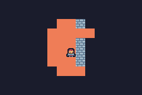

# tinyrogue

Experimental package for creating roguelike games using TinyGo on [Firefly Zero](https://fireflyzero.com/).

## Features

### Complete

- Customizable images with cache for tiles such as walls and floors
- Generative maps
- Field of View for torch-like illumination
- Creature behavior is configurable
- Creatures approach Player using shortest path astar algorithm
- Configurable action system for combat, spells, etc.

### TODO

- Game items
- Predefined maps/levels
- Multiple levels
- World map
- Creature spawning

## Useful tools

Here is a short list of some useful tools:

### Convert existing images to Sweetie 16 pallette
https://tezumie.github.io/Image-to-Pixel/

## Credits

Based on code originally from the following sources, but with many modifications:

https://github.com/cscazorla/roguelike

https://github.com/gogue-framework/gogue

Thank you!
